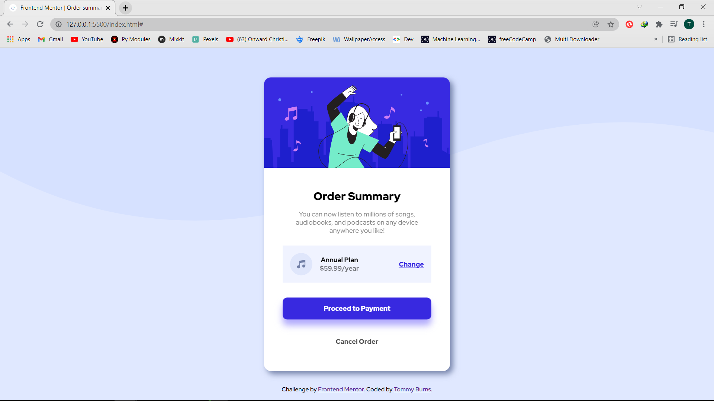

# order-summary-component-main
 Challenge by FrontEnd Mentor

# Frontend Mentor - Order summary card solution

This is a solution to the [Order summary card challenge on Frontend Mentor](https://www.frontendmentor.io/challenges/order-summary-component-QlPmajDUj). Frontend Mentor challenges help you improve your coding skills by building realistic projects. 

## Table of contents

- [Overview](#overview)
  - [The challenge](#the-challenge)
  - [Screenshot](#screenshot)
- [My process](#my-process)
  - [Built with](#built-with)
  - [What I learned](#what-i-learned)
  - [Continued development](#continued-development)
- [Author](#author)
- [Acknowledgments](#acknowledgments)


## Overview

### The challenge


### Screenshot
#### Below is a screenshot of the solution


## My process

### Built with

- HTML5
- CSS


### What I learned

As a newbie to FrontEnd Development, I learnt a lot of new things and I'm very happy I took this challenge.

```html
<h1>A big THANK YOU TO Frontend Mentor</h1>
```
```css
.proud-of-frontend-mentor {
  color: gold;
}
```
```js
const proud_Of_Myself = () => {
  console.log('🎉')
}
```


### Continued development
I look forward to taking more challnges of even higher difficulty levels and learn more powerful frameworks like  React.JS and all other frameworks and tools that will make me a seasoned developer.


## Author

- Frontend Mentor - [Tommy Burns](https://www.frontendmentor.io/profile/Tommy-Burns)
- LinkedIn - [Thomas Burns Botchwey](www.linkedin.com/in/thomas-burns-botchwey-4a4315201)


## Acknowledgments

A big thanks to [Bronsooonn](https://github.com/bronsooonn), his solution gave me an idea on how to go about the work.